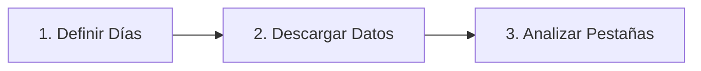

# 🛥️ MANUAL DE OPERACIÓN: AI Marine Analyzer (CAT 3516B)
**Dirigido a:** Jefe de Máquinas / Ingeniero de Cargo (Cheng)  
**Propósito:** Comprender, operar e interpretar la plataforma de análisis predictivo de telemetría mediante Inteligencia Artificial.

---

## 1. Introducción al Sistema
El **AI Marine Analyzer** es un software de Machine Learning diseñado específicamente para monitorear la salud operacional del motor principal **Caterpillar 3516B**. A diferencia de las alarmas tradicionales que solo saltan cuando se supera un límite fijo, este sistema evalúa múltiples variables al mismo tiempo para predecir fallas antes de que ocurran.

Los datos provienen del sistema de adquisición local de la Raspberry Pi y se guardan en la nube (**InfluxDB**), desde donde este analizador los procesa de forma segura.

---

## 2. Flujo de Trabajo Rápido (3 Pasos)

1. **Definir la Ventana Temporal**: En la barra lateral izquierda, ajusta el deslizador para seleccionar cuántos días atrás quieres analizar (ej. últimos 30 días).
2. **Cargar Datos**: Haz clic en el botón `Cargar Datos de InfluxDB`. El sistema descargará y agrupará la información minuto a minuto.
3. **Analizar**: Navega por las 4 pestañas de análisis para verificar la salud del motor.

---

## 3. Guía de Pestañas y Modelos de IA

### Pestaña 1: 📊 Explorador (Ver para entender)
* **¿Qué hace?** Muestra una tabla con los últimos datos y una gráfica interactiva de las **RPM del motor**.
* **Utilidad para Cheng:** Sirve para verificar rápidamente que la telemetría se está cargando de manera correcta y ver las tendencias generales de velocidad del motor.

---

### Pestaña 2: 🚨 Anomalías (Isolation Forest)
* **¿Qué algoritmo usa?** *Isolation Forest* (Bosque de Aislamiento).
* **Explicación Didáctica del Modelo:** 
  > [!TIP]
  > Imagina que el motor tiene una "zona de confort" donde siempre opera (ej. altas RPM implican alta temperatura y alta presión de aceite). Si de pronto el motor presenta *baja* presión de aceite con *altas* RPM, esto es inusual. El algoritmo aísla matemáticamente estos puntos discordantes sin que nosotros tengamos que definir reglas manuales.

* **Cómo operarlo:**
  1. Selecciona en la lista qué sensores quieres analizar en conjunto (se recomiendan mínimo: `engine_rpm`, `oil_pressure`, y `engine_temperature`).
  2. Ajusta la **Sensibilidad** (por defecto 5%). Esto le dice al algoritmo qué porcentaje estimado de anomalías graves buscar.
  3. Haz clic en **Ejecutar Isolation Forest**.
* **Cómo interpretar el resultado:**
  * Los puntos **Azules** son operación normal.
  * Los puntos **Rojos** son **Anomalías**. Si Cheng ve grupos de puntos rojos, significa que el motor operó fuera de su comportamiento normal y se requiere una inspección en la bitácora de esa fecha.

---

### Pestaña 3: 🔮 Predictivo (Random Forest)
* **¿Qué algoritmo usa?** *Random Forest* (Bosque Aleatorio - Análisis de Importancia de Variables).
* **Explicación Didáctica del Modelo:**
  > [!NOTE]
  > Este modelo entrena cientos de árboles de decisión para aprender cómo se relacionan todas las variables físicas entre sí. Si elegimos una variable crítica (por ejemplo, la temperatura de escape), el modelo calculará matemáticamente cuál de los demás sensores (como carga, presión de turbo, o fallas de inyectores) influye más en el aumento de esa temperatura.

* **Cómo operarlo:**
  1. Elige la **Variable Crítica** que te preocupa (ej. `exhaust_temperature`).
  2. Haz clic en **Ejecutar Random Forest**.
* **Cómo interpretar el resultado:**
  * Verás una gráfica de barras horizontales. Las barras más largas indican los sensores que tienen **mayor impacto** en el comportamiento de la variable crítica.
  * Si la barra de "Taponamiento de Filtro" tiene un 60% de impacto sobre la "Presión de Aceite", Cheng sabrá de inmediato que la causa raíz de una baja presión es la obstrucción física del filtro.

---

### Pestaña 4: 📄 Informe Ejecutivo
* **¿Qué hace?** Consolida de forma escrita y automática todos los hallazgos encontrados por la IA en las pestañas anteriores.
* **Uso práctico para Cheng:**
  * Muestra el resumen del periodo analizado, el número de anomalías críticas detectadas y el análisis de causa raíz.
  * Cuenta con un gran botón azul: **📥 Descargar Informe Detallado en PDF**. Cheng puede hacer clic allí para generar un reporte formal imprimible en PDF y entregárselo a la gerencia o archivarlo en el historial de mantenimiento del barco.

---

## 4. Diagnóstico de Fallas Comunes (Ejemplos)

| Síntoma en el Analizador | Algoritmo que lo Detecta | Causa Probable | Acción Recomendada por Cheng |
| :--- | :--- | :--- | :--- |
| Puntos rojos concentrados a bajas RPM. | Isolation Forest | Desviación térmica en cilindros o baja presión en ralentí. | Revisar temperaturas individuales de escape y filtros de aceite. |
| Temperatura de escape alta con impacto del inyector #8 > 70%. | Random Forest | Falla de inyección / desbalance de carga en cilindro #8. | Realizar test de compresión o desmontar inyector #8. |
| Variaciones bruscas de temperatura con impacto de delta de intercambiador. | Random Forest | Incrustaciones en el intercambiador de calor de agua de mar. | Limpieza física del haz de tubos del intercambiador. |
